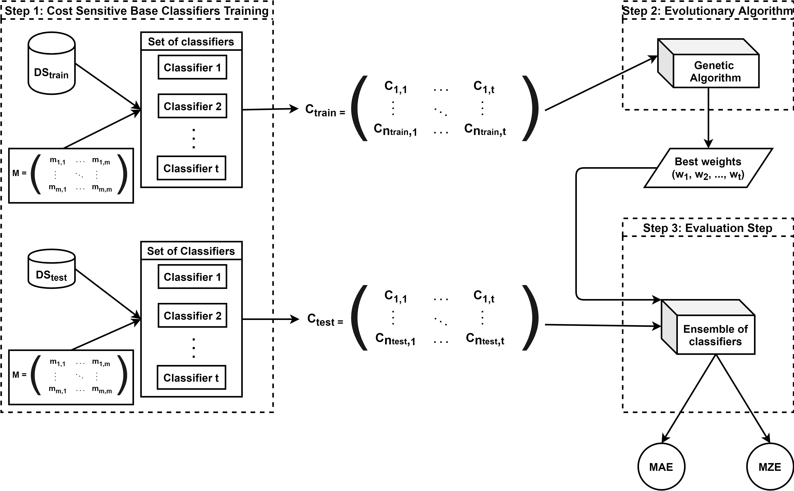

# OCEAn
**OCEAn: Ordinal Classification with an Ensemble Approach.**

Generally, classification problems catalogue instances according to their target variable, without taking into account a relation among the different labels. However, there are real problems in which the different values of the class are related to each other. Due to the interest in this type of problems, several solutions have been proposed, such as cost-sensitive classifiers. Ensembles have proven to be very effective for classification tasks, however, there are no proposals which use a genetic-based methodology as the metaheuristic to create the models. In this paper, we presente OCEAn, an Ordinal Classification algorithm based on an Ensemble Approach, which makes a final prediction according to a weighted vote. This weighted voting takes into account weights obtained by a genetic algorithm that tries to minimize the cost of classification. In order to test the performance of this approach, a comparison with ordinal classification algorithms in the literature has been carried out, proving that indeed, our approach improves previous results.

The necessary steps to carry out our methodology are enumerated in the figure below:

There are two main scripts in this repository: 
- **weka_costsensitive.py**: this file implements the first step of our methodology. It takes as input a dataset (an example is in *./data/*) and it is important to specify the cost matrix in the code, there is an example of 3-label cost matrix. The output of this script is an Excel file with the predictions carried out by cost-sensitive base classifiers (an example is in *./results/predictions/*).

- **main.py**: this script implements the second and third steps of our proposal, it needs *genetic_algorithm.py* script to carrying out the evolutionary algorithm. It carries out the optimization of the ensemble by means of a genetic algorithm. In order to run this script, a cost matrix and an excel with the prediction matrix is needed (it is the which one generated by *weka_costsensitive.py*, i.e., the which one in *./results/predictions/*. The output of this script consists on an excel file where the MAE and MZE for each of the iterations is calculated, it is saved in ./results/evaluation/. The log output where the predictions and the winning set of weights for the example dataset can be found in *./results/logs/*.
